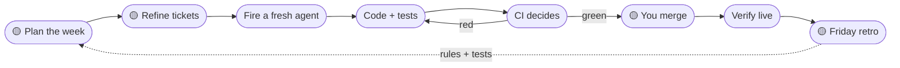

<div align="center">

# 🚇 Agent Line

**Run Claude like a small dev team, not one endless chat.**

A drop-in blueprint for building with AI agents without losing the plot: plan in one place, build in fresh sessions, let the tests decide, keep the truth in GitHub.

[](LICENSE)


[**Install into my repo**](#-install-into-an-existing-repo) · [**Start a new project**](https://github.com/quarrybank/agent-line/generate) · [**Download the blueprint**](https://github.com/quarrybank/agent-line/archive/refs/heads/main.zip) · [**Read the guide**](docs/GUIDE.md)

</div>

---

## The problem

You open a chat to build one feature. Four hours later you've chased six tangents, the context is full of half-finished threads, and nobody (not you, not Claude) remembers what the goal was. What's left is a pile of code you can't explain.

Agent Line fixes that by splitting **thinking** from **building**, and keeping state somewhere that isn't a chat window.

## The line

Every change rides the same route. Yellow stops need a human. Everything else, an agent can do.



| Station | What happens |
|---|---|
| **Plan** | One sprint goal you control. Pick the tickets that serve it. Nothing else gets in. |
| **Refine** | Each ticket gets an approach and its blockers named. Answer every question now, in one sitting. |
| **Fire** | A fresh Claude Code session gets one ticket. It reads `CLAUDE.md`, works on a branch, opens a PR. |
| **Build** | The definition of done includes the test that proves it. No test, not done. |
| **CI** | GitHub runs the checks. Red means the agent fixes it, not you. |
| **Merge** | You read the two-line summary at the top of the PR and press merge. |
| **Verify** | An agent checks the change works where users see it, then records what it learned. |
| **Retro** | Anything that went wrong twice becomes a rule in `CLAUDE.md` or a test. |

## The big idea: fresh agents, loaded the same way

Build agents start with a blank memory every time. That sounds like a weakness, and it's the whole point: they can't drift, can't carry last week's bad assumption, can't get tired.

Instead of remembering, every session reads the same things first:

- **`CLAUDE.md`**: the house rules. Stack, commands, how we work, what's bitten us before.
- **The ticket**: the full spec in the issue body. If a stranger couldn't build it from the ticket, it isn't ready.
- **Skills**: reusable how-tos, written once, used by every session.

Memory lives in the repo. To change how agents behave, you edit a file in a pull request, not a prompt you'll forget.

## What's in the blueprint

```
blueprint/
├── CLAUDE.md                          # house rules every agent reads first
├── docs/DEFINITION_OF_DONE.md         # the bar every PR is judged against
├── .github/
│   ├── ISSUE_TEMPLATE/story.yml       # user story, why, build, done, verify, files
│   ├── pull_request_template.md       # opens with what changed for users
│   └── workflows/ci.yml               # example CI: lint, types, tests
└── .claude/skills/
    ├── ticket/        /ticket       ideas → buildable issues; parks tangents
    ├── bug/           /bug          diagnose before anyone writes a fix
    ├── refine/        /refine       sprint refinement with a small agent panel
    ├── status/        /status       where things really stand, read live
    ├── merge/         /merge        close the loop after every merge
    ├── roundtable/    /roundtable   cross-functional pressure test for big calls
    └── reverse-uno/   /reverse-uno  step back when you've patched it 3 times
```

## 🔌 Install into an existing repo

Open Claude Code in your project and paste:

```
Install the Agent Line blueprint from https://github.com/quarrybank/agent-line into this repo. Follow its INSTALL.md.
```

Claude copies the files in, fills `CLAUDE.md` from your codebase, adapts the CI to your stack, and asks you anything it can't work out. It opens a PR and leaves the merging to you.

## 🆕 Start a new project

Click [**Use this template**](https://github.com/quarrybank/agent-line/generate), then open Claude Code in the new repo and say `install the blueprint`.

## 📦 Just the files

[Download the zip](https://github.com/quarrybank/agent-line/archive/refs/heads/main.zip) and copy the contents of `blueprint/` into your repo root.

## Four levels

Each one is useful on its own. Most of the benefit is in the first two.

| Level | Time | What you get |
|---|---|---|
| **1. GitHub is the memory** | an afternoon | GitHub MCP connected to Claude, `CLAUDE.md` written, backlog moved into issues |
| **2. Tests decide** | a day | CI on every PR, branch protection on `main` |
| **3. Planner ≠ builder** | a week | One planning chat writes tickets; separate sessions build them, one PR each |
| **4. Things run on their own** | when it hurts | Scheduled workers, your own MCP server, a self-hosted runner |

## Focus rules

The process is the guard rail. These are the ones that stop the drift.

- **Ideas become tickets.** New idea mid-build? `/ticket` it as `parking-lot` and get back to work.
- **One ticket, one behaviour.** If the PR summary needs "and also", it's two tickets.
- **Finish before starting.** One build in flight to begin with.
- **Decide early, in a batch.** Questions for the human get asked at refinement, not every ten minutes.
- **Cap every session.** A session that's been going for hours is lost, not working hard.
- **Ask the north-star question.** Does this week move you toward the thing you actually want?

The full guide, written so both you and Claude can read it, is in **[docs/GUIDE.md](docs/GUIDE.md)**.

## Contributing

Using it? Changed a skill and it worked better? Open an issue or a PR. Ideas for new skills are welcome, especially ones that came from something going wrong twice.

## License

[MIT](LICENSE). Built by [QuarryBank](https://github.com/quarrybank), from a decade of running product teams and 1,500+ agent-built pull requests.
